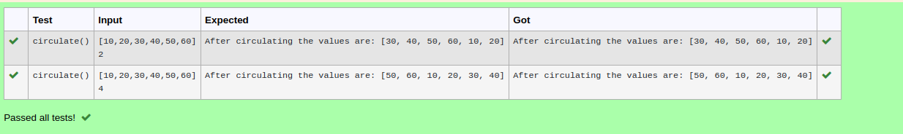

# Circulate-the-values-of-N-variables
## Aim:
To write a python program to circulate the n variables using function concept
## Equipment’s required:
PC
Anaconda - Python 3.7
## Algorithm: 
### Step 1: 
PC Anaconda - Python 3.7
### Step 2: 
Prepare the lists from each linear equations and assign in np.array().
### Step 3: 
Get the value from the user for the number of rotation
### Step 4: 
Using the slicing concept rotate the list
### Step 5: 
Add coding to the input value.
### Step 6:
Print the coding to get answer.
## Program:
```
a=eval(input())
b=int(input())
def circulate():
    for n in range (b+1):
        c=a[n:]+a[:n]
    return c
print("After circulating the values are:",circulate())
```
## Output:

## Result:
Thus,the program to circulate the n variables using fuction is executed successfully.